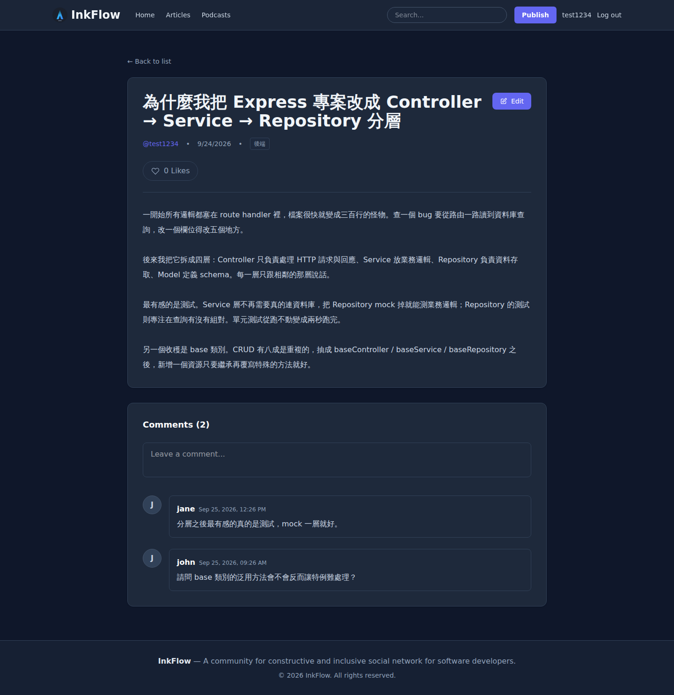
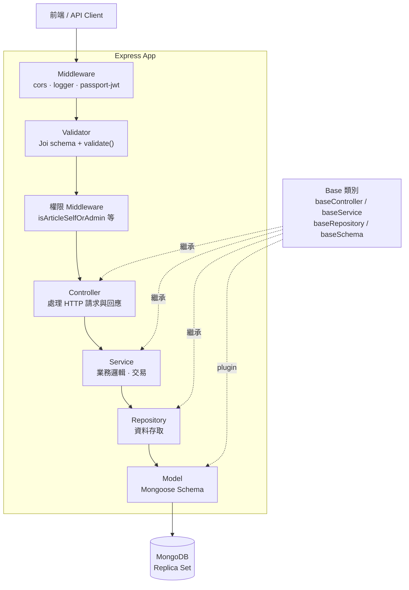
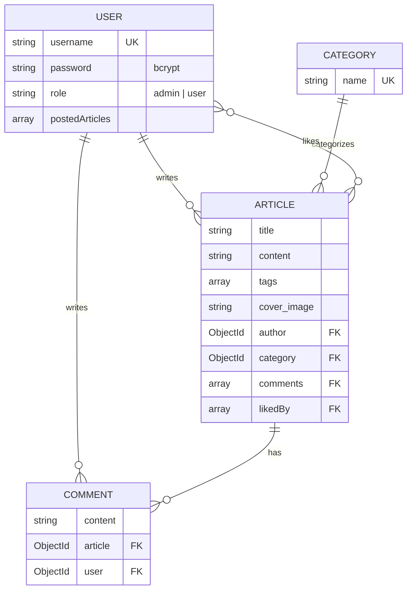

# InkFlow API

InkFlow 的後端 API — 一個部落格社群平台，使用 Node.js + Express + MongoDB，以 **Controller → Service → Repository → Model** 四層架構開發。

前端專案： [inkflow-web](https://github.com/cczzHoward/inkflow-web)



---

## 目錄

- [專案特色](#專案特色)
- [架構](#架構)
- [技術棧](#技術棧)
- [測試與覆蓋率](#測試與覆蓋率)
- [快速開始](#快速開始)
- [API 一覽](#api-一覽)
- [資料模型](#資料模型)
- [權限設計](#權限設計)
- [實作筆記](#實作筆記)

---

## 專案特色

- **嚴格分層**：每一層只與相鄰層溝通，業務邏輯不會洩漏到路由或資料層。
- **Base 類別**：`baseController` / `baseService` / `baseRepository` / `baseSchema` 抽出 CRUD 共用邏輯，新增資源只需繼承再覆寫特例。
- **212 個測試、91% 覆蓋率**：單元測試 168 個、整合測試 44 個，涵蓋所有分層。
- **MongoDB 交易**：新增／刪除評論會同時更動 `comments` 集合與文章的 `comments` 陣列，以 `session.withTransaction()` 確保原子性。
- **集中式驗證**：Joi schema 集中於 `validators/`，透過 middleware 掛在路由上，controller 拿到的資料保證已驗證。
- **統一回應格式**：所有 API 回應皆為 `{ success, message, data }`。

---

## 架構



各層職責：

| 層 | 職責 | 不該做的事 |
| --- | --- | --- |
| Controller | 解析請求、呼叫 Service、決定狀態碼 | 寫業務邏輯、直接碰資料庫 |
| Service | 業務規則、跨資源協調、交易 | 碰 `req` / `res` |
| Repository | 組查詢、`populate`、`lean` | 放業務判斷 |
| Model | Schema、索引、hook（如密碼雜湊） | 放查詢邏輯 |

### 專案結構

```text
src/
├── app.js                  # Express app 組裝（middleware + routes）
├── server.js               # 啟動進入點
├── base/                   # baseController / baseService / baseRepository / baseSchema
├── config/passport.js      # passport-jwt strategy
├── controllers/            # article · auth · category · comment · user
├── database/
│   ├── dbConnection.js     # 共用 mongoose connection（所有 model 綁在這條上）
│   └── seeders/            # user · category · article · comment · index
├── middlewares/            # auth（權限）· cors · logger · passport
├── models/                 # article · category · comment · user
├── repositories/           # article · category · comment · user
├── routes/                 # article · auth · category · comment · user
├── services/               # article · auth · category · comment · user
├── utils/                  # logger（winston）· response（統一格式）
└── validators/             # article · auth · comment · common · validate

tests/
├── setup.unit.js           # 單元測試：mock logger 與 mongoose 連線
├── setup.int.js            # 整合測試：開啟共用連線
├── unit/                   # 168 個測試，依分層對應
└── integration/            # 44 個測試，打真實 API + 資料庫

scripts/
└── merge-coverage.js       # 合併 unit + integration 的覆蓋率報告
```

---

## 技術棧

| 類別 | 使用 |
| --- | --- |
| 執行環境 | Node.js 20+ |
| 框架 | Express 5 |
| 資料庫 | MongoDB 6（Replica Set）+ Mongoose 8 |
| 認證 | JWT + Passport（passport-jwt）+ bcrypt |
| 驗證 | Joi 17 |
| 日誌 | winston + winston-daily-rotate-file |
| 測試 | Jest 29 + Supertest |
| 部署 | Docker Compose · GitHub Actions → DigitalOcean Droplet |

---

## 測試與覆蓋率

```bash
npm test                   # 單元測試（168 個，不需資料庫）
npm run test:integration   # 整合測試（44 個，需資料庫）
npm run test:coverage      # 單元測試覆蓋率
npm run test:coverage:all  # 單元 + 整合合併覆蓋率
```

**212 個測試全部通過。** 合併覆蓋率（排除 `server.js` 與 seeder）：

| 指標 | 覆蓋率 | |
| --- | --- | --- |
| Statements | **91.13%** | 555 / 609 |
| Lines | **91.19%** | 549 / 602 |
| Functions | **85.84%** | 91 / 106 |
| Branches | **74.00%** | 111 / 150 |

依分層：

| 層 | Statements | Branches | Functions |
| --- | --- | --- | --- |
| routes | 100% | 100% | 100% |
| validators | 100% | 100% | 100% |
| base | 98.52% | 88.88% | 100% |
| services | 98.07% | 100% | 88.23% |
| models | 95.55% | 50% | 100% |
| utils | 95.23% | 50% | 90% |
| middlewares | 91.66% | 85% | 100% |
| repositories | 91.48% | 66.66% | 90% |
| controllers | 82.35% | 71.73% | 83.33% |
| config | 83.33% | 50% | 100% |
| database | 44.44% | 50% | 0% |

> `database` 偏低是因為 `dbConnection.js` 的重連與事件處理分支在測試環境不會觸發。

**測試分工**

- **單元測試**：各層獨立測試，相依層以 `jest.mock()` 取代。不連資料庫，約 3 秒跑完。
- **整合測試**：用 Supertest 打真實路由，驗證 middleware 鏈、權限控管與資料庫互動。共用同一個資料庫，因此以 `maxWorkers: 1` 序列執行。

`npm run test:coverage:all` 會分別執行兩個 jest project 再用 istanbul 合併報告 —— 因為 jest 的 `projects` 設定在單次執行中同時跑多個 project 時，覆蓋率表格會是空的。

---

## 快速開始

### 使用 Docker Compose（推薦）

一次啟動後端與三節點 MongoDB Replica Set。**需要 Replica Set 才能使用交易功能。**

```bash
git clone git@github.com:cczzHoward/inkflow-api.git
cd inkflow-api
```

建立 `docker.env`：

```env
MONGODB_URI=mongodb://mongo1:27017,mongo2:27017,mongo3:27017/inkflow?replicaSet=rs0
BCRYPT_SALT_ROUNDS=10
JWT_SECRET=請換成你自己的密鑰
JWT_EXPIRATION=1h
```

啟動並灌入初始資料：

```bash
docker compose up -d --build
docker compose exec backend npm run seed
```

- API： http://localhost:8080
- 用 Compass 連線： `mongodb://localhost:27017/inkflow?directConnection=true`
  （需要 `directConnection=true`，否則會因為 replica set 回報的是容器名稱而解析失敗）

預設帳號： `admin / admin123`（管理員）、`test1234 / test1234`（一般使用者）。

關閉：`docker compose down`

### 不使用 Docker

需自備 MongoDB Replica Set，建立 `.env`（欄位同上，`MONGODB_URI` 指向你的資料庫），然後：

```bash
npm ci
npm run seed
npm run watch      # 開發模式（nodemon）
```

---

## API 一覽

Base URL：`/api/v1`

### 認證

| Method | Path | 說明 | 需登入 |
| --- | --- | --- | --- |
| POST | `/users/register` | 註冊 | |
| POST | `/users/login` | 登入，回傳 JWT | |
| POST | `/users/change-password` | 變更密碼 | ✔ |

> 登出由前端移除 token 即可，後端不維護黑名單。

### 文章

| Method | Path | 說明 | 需登入 |
| --- | --- | --- | --- |
| GET | `/articles/list` | 文章列表（支援搜尋與分頁） | |
| GET | `/articles/:id` | 文章詳情 | |
| GET | `/articles/liked` | 我按讚的文章 | ✔ |
| POST | `/articles/` | 新增文章 | ✔ |
| PATCH | `/articles/:id` | 編輯文章（作者或 admin） | ✔ |
| DELETE | `/articles/:id` | 刪除文章（作者或 admin） | ✔ |
| POST | `/articles/:id/like` | 按讚 | ✔ |
| DELETE | `/articles/:id/like` | 取消按讚 | ✔ |

### 評論 / 分類 / 使用者

| Method | Path | 說明 | 需登入 |
| --- | --- | --- | --- |
| POST | `/comments/:id` | 對文章發表評論 | ✔ |
| DELETE | `/comments/:id` | 刪除評論（作者或 admin） | ✔ |
| GET | `/categories/list` | 分類列表 | |
| DELETE | `/users/:id` | 刪除使用者 | ✔ |

### 文章列表查詢參數

`GET /articles/list` 支援：

| 參數 | 說明 | 預設 |
| --- | --- | --- |
| `keyword` | 標題或內容模糊搜尋 | |
| `category` | 分類名稱，自動轉為 ObjectId 查詢 | |
| `page` | 頁碼 | 1 |
| `limit` | 每頁筆數 | 10 |

回傳 `{ data, total, page, limit, totalPages }`，依 `created_at` 由新到舊排序。

```
GET /api/v1/articles/list?keyword=mongodb&category=資料庫&page=2&limit=5
```

### 回應格式

```json
{ "success": true, "message": "操作成功", "data": { } }
{ "success": false, "message": "錯誤訊息", "data": null }
```

---

## 資料模型



所有 schema 皆套用 `baseSchema` plugin，自動帶入 `created_at` / `updated_at`。

---

## 權限設計

JWT payload 帶入 `role`，經 passport 驗證後掛載於 `req.user`，再由路由層的權限 middleware 判斷。

| 資源 | admin | 一般使用者 |
| --- | --- | --- |
| 文章編輯／刪除 | 全部 | 僅自己的 |
| 評論刪除 | 全部 | 僅自己的 |
| 刪除帳號 | 自己以外的所有人 | 僅自己 |

權限邏輯集中在 [`src/middlewares/auth.js`](src/middlewares/auth.js)。

---

## 實作筆記

幾個開發過程中值得記錄的決定：

**為什麼舊密碼錯誤回 400 而不是 401**
變更密碼時使用者的 JWT 是有效的，錯的是 request body 的內容。而前端 axios 的 response interceptor 會在收到 401 時清掉 `auth_token` —— 如果這裡回 401，使用者打錯一次舊密碼就會被登出。認證失敗與參數錯誤不該共用同一個狀態碼。

**列表查詢的 N+1 與 payload**
`populate` 不是 JOIN，每個 populate 欄位都是額外一次查詢。文章列表因此不 populate `comments`，只回傳 `comments_count` 並把陣列本身移除；整條查詢鏈加上 `.lean()` 跳過建立 Mongoose document 實例的開銷。

**整合測試與 NODE_ENV**
Jest 會強制設定 `NODE_ENV=test`，而 `dbConnection.js` 在測試環境刻意不自動連線。但所有 model 都綁在那條共用連線上，測試檔案自己呼叫的 `mongoose.connect()` 開的是另一條 default connection，model 並不會使用。因此 `tests/setup.int.js` 必須主動開啟共用連線，否則每個查詢都只會被 buffer 到逾時為止。

**交易需要 Replica Set**
MongoDB 的多文件交易依賴 oplog，standalone 模式不支援。開發環境以 docker-compose 起三節點 replica set；若只是要跑測試，`mongodb-memory-server` 的 `MongoMemoryReplSet` 可以開單節點 replica set，單節點同樣支援交易。

---

## 待辦

- [ ] 補強 controller 層的錯誤分支測試（目前 branches 71.73%）
- [ ] `dbConnection.js` 的重連邏輯加上測試
- [ ] 評論分頁
